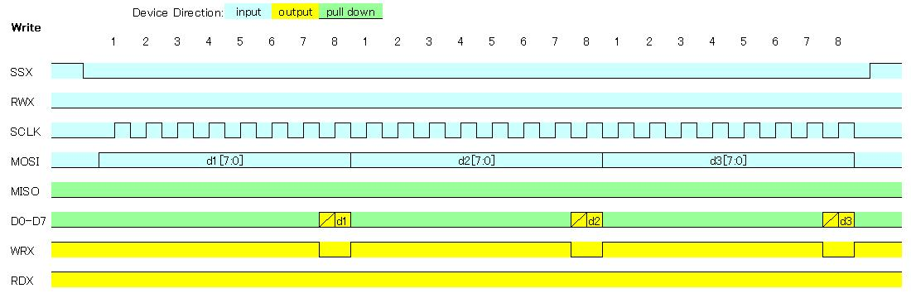
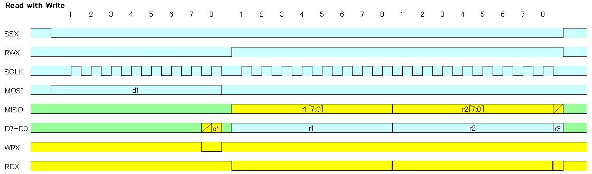

# SPI to 8080-system bus bridge using GreenPAK. (緑豆壱拾漆號)
  
GreenPAK用のデザインデータです。  
SPIインタフェースから8080-systen 8bitバスに対応したデバイスへのアクセスを可能にします。  
SLG46826V(STQFN) または SLG46826G(TSSOP) に対応しています。   

現在、この設計はシミュレーションでのみ動作を確認しています。  
Currently, this design has only been tested in simulation.  

## 機能
- SPI mode0に対応
- 8080-systen 8bitバスのリードライトが可能
  

## ピンアサイン
  
### SPI2BUS
STQFN Pin # | TSSOP Pin # | 機能名 | IO | 内蔵抵抗 | SLG46826端子名 | 機能
--- | --- | --- | --- | --- | --- | ---
1  | 20 | VDD | -   | -      | VDD  |  2.3V～5.5V
2  | 19 | RWX | I   | -      | IO0  | READ(high)/WRITE(low) control
3  | 18 | MISO| O   | PD1M   | IO1  | Master In Slave Out
4  | 17 | MOSI| I   | -      | IO2  | Master Out Slave In
5  | 16 | SSX | I   | -      | IO3  | Slave Select, active low
6  | 15 | D0  | I/O | PD1M   | IO4  | Data [0],lsb
7  | 14 | D1  | I/O | PD1M   | IO5  | Data [1]
8  | 13 | SCL | I   | -      | SCL  | SCL for SLG46826
9  | 12 | SDA | I/O | -      | SDA  | SDA for SLG46826
10 | 11 | RDX | O   | -      | IO6  | Read strobe signal, active low
11 | 10 | GND | -   | -      | GND  |  GND
12 | 9  | WRX | O   | -      | IO7  | Write strobe signal, active low
13 | 8  | SCLK| I   | -      | IO8  | Serial Clock
14 | 7  | VDD2| -   | -      | VDD2 |  2.3V～5.5V
15 | 6  | D2  | I/O | PD1M   | IO9  | Data [2]
16 | 5  | D3  | I/O | PD1M   | IO10 | Data [3]
17 | 4  | D4  | I/O | PD1M   | IO11 | Data [4]
18 | 3  | D5  | I/O | PD1M   | IO12 | Data [5]
19 | 2  | D6  | I/O | PD1M   | IO13 | Data [6]
20 | 1  | D7  | I/O | PD1M   | IO14 | Data [7], msb

### 内蔵抵抗
I2Cを除く双方向端子の内蔵抵抗を有効にしています。
記号はおおよその抵抗値を表しており、値は以下の通りです。  
- PD1M: Pull-down 1M ohm  
  
## タイミングチャート
SPIフォーマットと8bit BUSフォーマットの間の基本的なタイミングチャートを紹介します。
  
### ライト
タイミングチャートは以下の通りです。  
   
  
### リード
タイミングチャートは以下の通りです。  
  
  
### アドレス指定リード
SPIデバイスの多くはリード前にアドレス指定が必要ですので、こちらのフォーマットでリードアクセスしてください。  
タイミングチャートは以下の通りです。  
  
  
## 設計データ
「GreenPAK6 Designer」で  
SPI2BUS.gp6  
を開き、SLG46826Vに焼いてください。  
プルアップ／プルダウン抵抗、ドライブ能力などはお好きに変更して下さい。
SLG46826G に焼く場合は、File-Project info で Packageを「TSSOP-20」に変更してください。  
  
## 免責事項
当方は、利用者に対して、このデザインおよびこの資料（以下、本デザイン等）に関する当方または第三者が有する著作権、特許権、商標権、意匠権及びその他の知的財産権をライセンスするものではありませんし、本デザイン等の内容についていかなる保証をするものでもありません。また当方は、本デザイン等を用いて行う一切の行為について何ら責任を負うものではありません。本デザイン等の情報の利用、内容によって、利用者にいかなる損害、被害が生じても、当方は一切の責任を負いません。ご自身の責任においてご利用いただきますようお願いいたします。   
  
  
## Author  
[GitHub/AoiSaya](https://github.com/AoiSaya)  
[Twitter ID @La_zlo](https://twitter.com/La_zlo)  
